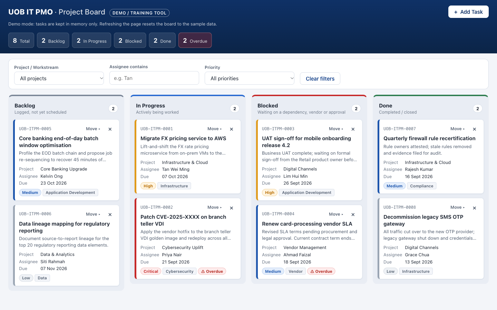
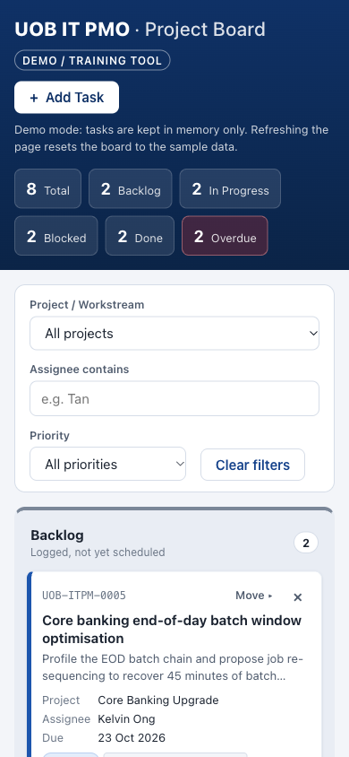

# UOB IT PMO — Kanban Board (Demo)

A single-page Kanban board for tracking IT project tasks, built as an **internal demo / training tool**. It is not an official UOB system and uses no UOB logos or trademarks.



<details>
<summary>Mobile view (390px)</summary>



</details>

<sub>Screenshots of the live site, captured with the Playwright MCP server.</sub>

## Quick start

**Live demo:** https://ramki2k3.github.io/Claude_Project/

To run it yourself:

1. Download or clone this repo.
2. Double-click **`index.html`** to open it in any modern browser.

You don't need a server, an install or an internet connection. The internet is only used for the optional email notification.

> **Note:** the board keeps tasks in memory only. **Refreshing the page resets it** to the 8 sample tasks. This is intended for demos and training.

## Features

- **Four columns:** Backlog, In Progress, Blocked and Done. Each shows a live task count.
- **Drag and drop** cards between columns. The target column is highlighted while you drag.
- **Keyboard friendly:** every card has a **Move ▸** button, so you can move it without a mouse. Use Tab, Enter, the arrow keys and Esc.
- **Priority colours:** a card's left border is red for Critical, amber for High, blue for Medium and grey for Low. Each card also has a text label.
- **Overdue badge** on unfinished tasks that are past their due date.
- **Add Task form** with checks on each field, such as required fields, a character limit and no due dates in the past. Errors appear under the field.
- **Delete** with an in-card "Delete? Yes / No" confirmation.
- **Filters** by project, assignee (partial name) and priority.
- **Header summary** showing total tasks, tasks per status and overdue tasks.
- **Email notification** for each new task, sent through [FormSubmit](https://formsubmit.co). If sending fails, the task stays on the board and a warning appears.

## Setting up email notifications

1. Open `index.html` in a text editor and find this line near the top of the `<script>` section:
   ```js
   const FORMSUBMIT_ENDPOINT = "https://formsubmit.co/ajax/YOUR_EMAIL@example.com";
   ```
2. Replace `YOUR_EMAIL@example.com` with the address that should receive notifications.
3. **Activate it once.** Add one task. FormSubmit emails that address a confirmation link, and no notifications arrive until someone clicks it.

Until this is set up, adding a task shows the warning "Card added locally — email notification failed". The board itself works normally.

If notifications don't send when the page is opened directly from disk, serve the folder locally and open `http://localhost:8000` instead:

```bash
python3 -m http.server
```

## Tech notes

- One file, `index.html`, holds all the HTML, CSS and JavaScript. It uses no frameworks, build tools or external libraries, fonts or images.
- Nothing is saved in the browser: no local storage and no cookies.
- Everything typed into the form is escaped before it is shown on the page.

## Deployment

The live demo is hosted on GitHub Pages. Every push to `main` runs the **Deploy to GitHub Pages** workflow in `.github/workflows/pages.yml`, which publishes only `index.html`. The update is usually live within a minute.

## Making the board persistent

Saving the board would need a small backend with a database, plus API calls from the add, move and delete actions. The server would also need to issue task IDs so different users don't get clashing ones. In the code, all tasks already live in one `state.tasks` array, which is the single place to load from and save to.
